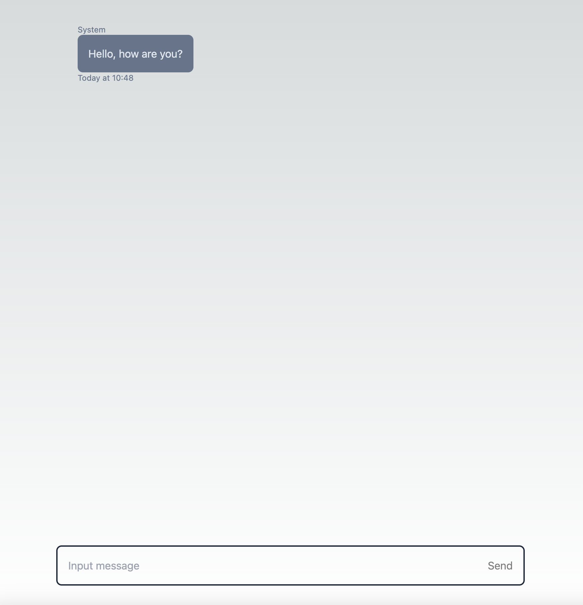

## Justin Rich's Typeface Coding Excecise

This is Justin Rich's submission for [Typeface's engineering takehome](./public/Design%20a%20Chat%20application-Candidate-Guide.pdf).

### Technical Decisions

To make this app I made the following decisions:

- React: used because it was required in the instructions, and I like it
- NextJS: initially I had contemplated using the API routing feature to create a thin API to send user/chat data. However due to time I was not able to do this. I persisted in NextJS because it will allow us to easily add a backend service to handle advanced features. Because we are using useReducer we must declair "use client" at top of the page which essentually makes the page a CSR page. However the Next framework is still a smart choice because it allows us to extend the app and prefetch important information like user data in the future.
- Tailwind: this CSS framework allows for easy prototyping because basic css styles can be added inline via pre-defined className values.
- useReducer: Local state management is managed via a useReducer rather than series of useState. useReducer allows stateful data that changes in parallel to be mutated.
- No Central State: because the requirements for this POC where simple I decided to keep all stateful data in a native React hook (useReducer). However, if we where to add features and require data that needs to be used beyond this page (like user data) it may be useful to manage such data in a central state system (Redux, Apollo, etc).

### Getting Started

1. install dependencies: `yarn install`
2. build application: `yarn build`
3. start application: `yarn start`
4. navigate to `http://localhost:3000` on your browser

### Using the application

On start you should see something like this:

You should see a default message that is set to a "non-user" message. For this POC all messages will be from you the user. The default message is just to display the experience of recieving messages from users other than yourself.

#### Sending a message

Test state management and UX by sending a few messages, they all should appear on the right hand side of the screen.

#### Deleting a message

To delete a message you can click the red ❌ to the right of your message and the message will be removed from the conversation.

### Next Steps

There are several features missing, here's a few improvements I would recommend

- **create a backend**: this would allow us to persist data between sessions and receive messages from users outside the web client.
- **user management**: right now the user IDs and information are hardcoded, this won't work for a production application. We would need to implement user management within a backend service. This app would then need to change to fetch and manage state based on user information
- **multimedia sharing**: people want to share videos, pictures, links. We would need to be able to handle the uploading and rendering of multimedia data. This would involve a storage bucket on the backend and validation of file types to ensure system reliability.
- **groups/channels**: the way the local state is managed allows for multiple users to be added to the chat. Part of adding "user management" would be to allow us to invite other "external" members to the chat. This would also require a user search by some primary identifier like email or ID. Once added the external member's messages would appear on the left.
- **realtime data transmission**: to show new messages we could poll the server for new messages. Alternatively we could also push changes to the clients via the implementation of webhooks.
